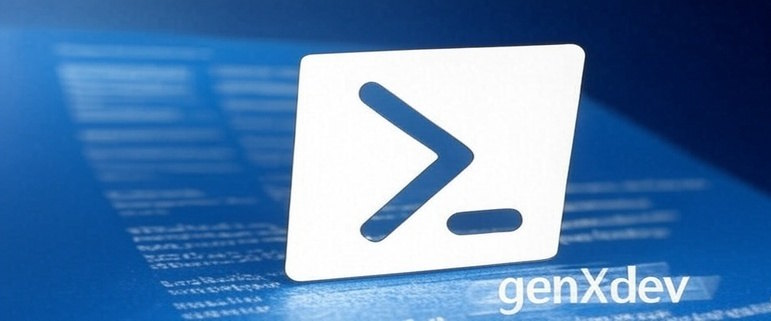

<hr/>



<hr/>

### NAME
    GenXdev Powershell Modules
### SYNOPSIS
    A comprehensive PowerShell productivity suite for power users and developers, integrating AI, browser automation, media management, database tools, file system utilities, and Windows system control into a unified command-line workflow.

[](https://genxdev.net/)<br>[](https://www.powershellgallery.com/packages/GenXdev/)  [](./LICENSE) [](https://github.com/genXdev/GenXdev.PowerShell/tree/main/Tests)

### INSTALLATION
```PowerShell
Install-Module GenXdev

cmds
```

### UPDATE

```PowerShell
Update-Module GenXdev
```

<hr/>

## GNU General Public License 3.0

````text
Copyright (C) 2026 René Vaessen / GenXdev

This program is free software: you can redistribute it and/or modify
it under the terms of the GNU General Public License as published by
the Free Software Foundation, either version 3 of the License, or
(at your option) any later version.

This program is distributed in the hope that it will be useful,
but WITHOUT ANY WARRANTY; without even the implied warranty of
MERCHANTABILITY or FITNESS FOR A PARTICULAR PURPOSE.  See the
GNU General Public License for more details.

````

You should have received a copy of the GNU General Public License
along with this program. If not, see [https://www.gnu.org/licenses/gpl-3.0.txt](https://www.gnu.org/licenses/gpl-3.0.txt).

<hr/>

### Documentation

| BCP47 | Language | Location |
| :--- | :--- | :--- |
| en-US | English (United States) | [https://github.com/genXdev/GenXdev.PowerShell/blob/main/Docs/en-US/README.md](https://github.com/genXdev/GenXdev.PowerShell/blob/main/Docs/en-US/README.md) |

<hr/>

## [GenXdev](README-GenXdev.md)

The root GenXdev module is the entry point to the platform. It provides the
discovery cmdlets that let you explore the full suite — list every module,
cmdlet, and alias in one view, or search for specific commands and open their
source instantly.

[Read more →](README-GenXdev.md)

<hr/>

## [GenXdev.FileSystem](README-GenXdev.FileSystem.md)

GenXdev.FileSystem provides advanced file and directory management beyond what
the built-in PowerShell providers offer. It handles long paths (>260 chars),
multi-threaded search with a custom pattern parser, robust copy via RoboCopy,
atomic file writes, duplicate detection, and project-wide text replacement.

### Features

- ☐ [P1] Find files with Find-Item -> l
    * Fast multi-threaded search with advanced pattern matching
    * Content searching via Select-String integration
    * Multi-drive support with extensive filtering options
- ☐ [P1] Pretty good wrapper for robocopy: Start-RoboCopy -> rc, xc
    * Folder synchronization, long path support, restartable mode
    * Multi-threaded copying, network compression, recovery mode
- ☐ [P1] Easily change directories with Set-FoundLocation -> lcd
- ☐ [P1] Text replacement throughout a project directory: Rename-InProject -> rip
- ☐ [P1] Delete complete directory contents with Remove-AllItems -> sdel
- ☐ [P1] Move files and directories with Move-ItemWithTracking

[Read more →](README-GenXdev.FileSystem.md)

<hr/>

## [GenXdev.AI](README-GenXdev.AI.md)

GenXdev.AI manages multi-provider LLM settings, powers interactive text and
audio chat sessions, handles AI-powered text translation with persistent
caching, exposes an MCP (Model Context Protocol) server so external AI
editors can invoke GenXdev cmdlets as tools, and optionally routes unknown
shell commands to AI for suggestions.

### Features

* Large Language Model (LLM) API helpers — `llm`, `llmchat`, `hint`
* Audio and Speech Processing — `transcribefile`, `transcribe`, `llmaudiochat`
* Text Processing — `emojify`, `translate`, `spellcheck`, `getlist`, `equalstrue`

[Read more →](README-GenXdev.AI.md)

<hr/>

## [GenXdev.AI.DeepStack](README-GenXdev.AI.DeepStack.md)

PowerShell functions to interact with DeepStack's face recognition API running
in a Docker container — face detection, face recognition, object detection,
and image enhancement.

[Read more →](README-GenXdev.AI.DeepStack.md)

<hr/>

## [GenXdev.AI.Queries](README-GenXdev.AI.Queries.md)

GenXdev.AI.Queries wraps LLM chat completion APIs for raw queries and
structured outputs (boolean, list, transformation), powers AI-driven
PowerShell command generation, and provides the image metadata pipeline.

[Read more →](README-GenXdev.AI.Queries.md)

<hr/>

## [GenXdev.Coding](README-GenXdev.Coding.md)

GenXdev.Coding provides AI-powered code refactoring workflows and structured
README management. The refactoring engine lets you define sets of files that
need transformation, use LLM analysis to select candidates, and work through
them one at a time with AI assistance.

### Features

* AI-Powered Code Refactoring — `New-Refactor`, `Start-NextRefactor`, `Update-Refactor`
* Documentation Management — track features, ideas, issues, todos, and release notes

[Read more →](README-GenXdev.Coding.md)

<hr/>

## [GenXdev.Coding.Git](README-GenXdev.Coding.Git.md)

Git repository maintenance utilities — permanently purge files and folders
from a repository's entire history across all branches, list changed files,
and create commits with a single command.

[Read more →](README-GenXdev.Coding.Git.md)

<hr/>

## [GenXdev.Coding.PowerShell.Modules](README-GenXdev.Coding.PowerShell.Modules.md)

The meta-module — generates MAML XML help and per-cmdlet markdown, runs
PSScriptAnalyzer, validates cross-module references, and provides
AI-assisted cmdlet improvement workflows.

[Read more →](README-GenXdev.Coding.PowerShell.Modules.md)

<hr/>

## [GenXdev.Coding.Templating](README-GenXdev.Coding.Templating.md)

String templating utilities for code generation and text formatting —
format collections of objects against a template string with property
placeholders, and clean up double empty lines in generated code.

[Read more →](README-GenXdev.Coding.Templating.md)

<hr/>

## [GenXdev.Console](README-GenXdev.Console.md)

Terminal enhancement utilities — text-to-speech with pause/resume,
date/time announcements, a built-in Snake game, Windows Terminal tab
management, and quick-access commands for monitor positioning.

[Read more →](README-GenXdev.Console.md)

<hr/>

## [GenXdev.Data.KeyValueStore](README-GenXdev.Data.KeyValueStore.md)

A persistent JSON-based key-value store on the local filesystem. Create
named stores, set and get values by key, enumerate keys, and remove entries
or entire stores.

[Read more →](README-GenXdev.Data.KeyValueStore.md)

<hr/>

## [GenXdev.Data.Preferences](README-GenXdev.Data.Preferences.md)

A tiered preference system: a session-scoped global variable for temporary
overrides, and persistent JSON-based key-value stores for durable storage.
Stores LLM provider configs, monitor defaults, known paths, license
acceptance flags, and other module settings.

[Read more →](README-GenXdev.Data.Preferences.md)

<hr/>

## [GenXdev.Data.SQLite](README-GenXdev.Data.SQLite.md)

Comprehensive SQLite database access from PowerShell — schema discovery,
table and view data retrieval, transaction management, and query execution,
plus SQLiteStudio integration.

[Read more →](README-GenXdev.Data.SQLite.md)

<hr/>

## [GenXdev.Data.SqlServer](README-GenXdev.Data.SqlServer.md)

Comprehensive SQL Server database access from PowerShell — mirrors
GenXdev.Data.SQLite's cmdlet surface with SSMS integration.

[Read more →](README-GenXdev.Data.SqlServer.md)

<hr/>

## [GenXdev.Hardware](README-GenXdev.Hardware.md)

System hardware introspection — CPU capabilities (core count, AVX support),
GPU detection (CUDA capability and memory), monitor count, audio device
enumeration, and serial port output.

[Read more →](README-GenXdev.Hardware.md)

<hr/>

## [GenXdev.Helpers](README-GenXdev.Helpers.md)

General helpers that don't fit any of the other categories — Spectre.Console
terminal UI integration, LLM tool-call execution, JSON Schema example
generation, NuGet assembly loading, file output formatting with hyperlinks,
module import utilities, and user consent management.

[Read more →](README-GenXdev.Helpers.md)

<hr/>

## [GenXdev.Helpers.Physics](README-GenXdev.Helpers.Physics.md)

A physics calculation library in PowerShell covering kinematics, forces,
energy, waves, optics, gravitation, and fluid dynamics — over 25 specialized
calculation functions plus a general-purpose unit converter.

[Read more →](README-GenXdev.Helpers.Physics.md)

<hr/>

## [GenXdev.Media](README-GenXdev.Media.md)

Media playback control and metadata extraction — VLC Media Player management
(launch, playlist navigation, pause/mute/repeat toggle, lyrics lookup),
image metadata (EXIF, geolocation), media file creation dates, and video
stabilization with FFmpeg.

[Read more →](README-GenXdev.Media.md)

<hr/>

## [GenXdev.Queries](README-GenXdev.Queries.md)

Dispatches search terms across multiple AI providers, search engines, and
content sources simultaneously — open a question in ChatGPT, Google,
Wikipedia, and Stack Overflow all at once with a single command.

### Features

* Query any LLM with `Ask "anything"`
* Search any topic with `q`
* Query multiple search engines at once with `qq`
* Query text from API providers with `qqq`
* Control youtube with `qvideos`

[Read more →](README-GenXdev.Queries.md)

<hr/>

## [GenXdev.Queries.AI](README-GenXdev.Queries.AI.md)

Opens AI chat interfaces in your browser with your query pre-filled —
ChatGPT, Google Gemini, DeepSeek, GitHub Copilot, Bing Copilot, X Grok,
and a generic cloud LLM chat that routes through GenXdev's own AI settings
with support for PowerShell cmdlets made available to the LLM.

[Read more →](README-GenXdev.Queries.AI.md)

<hr/>

## [GenXdev.Queries.Text](README-GenXdev.Queries.Text.md)

Text-based lookups — Wikipedia article summaries and random affirmations.

[Read more →](README-GenXdev.Queries.Text.md)

<hr/>

## [GenXdev.Queries.Webbrowser](README-GenXdev.Queries.Webbrowser.md)

Opens search queries across every major search engine and information site
— Google, Bing, GitHub, Stack Overflow, YouTube, IMDB, Wikipedia, Wolfram
Alpha, and site analysis tools like BuiltWith, SimilarWeb, Whois, and the
Wayback Machine.

[Read more →](README-GenXdev.Queries.Webbrowser.md)

<hr/>

## [GenXdev.Software](README-GenXdev.Software.md)

Collection of helpers that ensures third-party tools are installed and
available on your system. Each `Ensure*` cmdlet checks for the tool,
installs it if missing, and adds it to the PATH. Covers 3th party
apps like Docker, Playwright, FFmpeg, 7-Zip, VS Code, WinMerge,
SQLiteStudio, SSMS, Pester, GitHub CLI, PSTools, Paint.NET, DeepStack,
and the Windows Media Feature Pack.

[Read more →](README-GenXdev.Software.md)

<hr/>

## [GenXdev.Webbrowser](README-GenXdev.Webbrowser.md)

Complete browser automation — launch, position, and close browser windows;
manage tabs; import/export and search bookmarks across Chrome, Edge, and
Firefox; execute JavaScript and CSS selector queries against the DOM;

### Features

* PlayWright browser control
* Launching of default browser, Microsoft Edge, Google Chrome or Firefox
* Launching of webbrowser with full control of window positioning
* Launching of webbrowser with a large set of options

[Read more →](README-GenXdev.Webbrowser.md)

<hr/>

## [GenXdev.Webbrowser.Playwright](README-GenXdev.Webbrowser.Playwright.md)

Manages persistent Playwright browser sessions — launches browsers with
reusable user profiles for automated scripting and testing.

[Read more →](README-GenXdev.Webbrowser.Playwright.md)

<hr/>

## [GenXdev.Windows](README-GenXdev.Windows.md)

Comprehensive Windows system control — window management, input simulation,
system administration, monitor control, and access to Windows known folders
and taskbar settings.

### Features

* Allow resizing/repositioning/closing of Windows
* Get-Window returns a windows helper for window manipulation
* Read/write access to Windows special folder locations

[Read more →](README-GenXdev.Windows.md)

<hr/>

## [GenXdev.Windows.WireGuard](README-GenXdev.Windows.WireGuard.md)

PowerShell functions to manage a WireGuard VPN server running in a Docker
container — set up the server, add/remove peers, generate QR codes for
mobile setup, and monitor connection status.

[Read more →](README-GenXdev.Windows.WireGuard.md)

<hr/>
